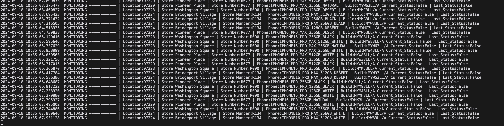

# Apple Restock Monitor

This project monitors Apple store inventory for specific iPhone models and sends notifications to Discord when items are restocked.




## Disclaimer

This tool is for educational purposes only. Be sure to comply with Apple's terms of service and local laws when using this monitor.


## Setup

1. Clone the repository:
   ```
   git clone https://github.com/your-username/apple-restock-monitor.git
   cd apple-restock-monitor
   ```

2. Create a virtual environment and activate it:
   ```
   python -m venv venv
   source venv/bin/activate  # On Windows, use `venv\Scripts\activate`
   ```

3. Install the required packages:
   ```
   pip install -r requirements.txt
   ```

4. Set up your proxy list:
   - Open the `proxy.txt` file
   - Add your proxies, one per line, in the format: `http://username:password@ip:port`

5. Set up your Discord webhook:
   - Open `main.py`
   - Replace the empty string in `WEBHOOK_URL = ""` with your Discord webhook URL

## Running the Monitor

To start the Apple Restock Monitor, simply run:
```
python main.py
```


## Customization
- To monitor different stores or iPhone models, modify the `productsJson` dictionary in `main.py`.
- Adjust the monitoring frequency by changing the `await asyncio.sleep(5)` value in the `fetch` method of the `AppleMonitor` class.

## Notes

- Ensure your proxies are reliable and rotated regularly to avoid IP bans.
- Be respectful of Apple's servers and avoid setting the monitoring frequency too high.

